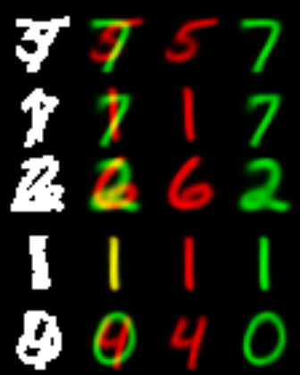
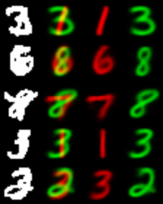
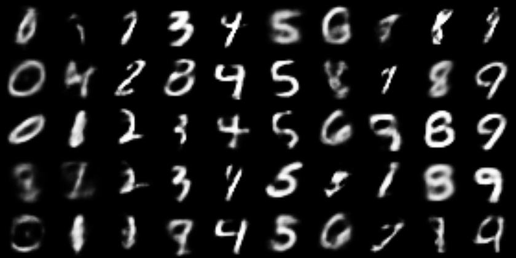

# A simple tensorflow implementation for CapsNet

# Network configuration

According to  Hinton's paper [Dynamic Routing Between Capsules](https://arxiv.org/abs/1710.09829)

# Train your model

	python main.py

you can switch the is_multi_mnist to change the training set between Mnist and MultiMnist

# Classification result on Mnist

batch_size = 64, lr = 0.001, beta1 = 0.9, decay_freq = 2k steps, min_lr = 1e-6, after 10k+ steps

is_shift_agumentation = True

# Results on MultiMnist

is_shift_agumentation = False

* ## classification

batch_size = 128, lr = 0.001, beta1 = 0.9, after 30k+ training steps

* ## segmenting

batch_size = 64, lr = 0.001, beta1 = 0.9, decay_freq = 2k steps, min_lr = 1e-6, after 10k+ steps

Here are some images showing the results of segmenting highly overlapping digits:

* ## image generation condition on class

I generated some images from random DigitCapsule vectors near the unit sphere :
 

 
as we can see, it's not so real, 
but the pervious images show good results.
and notice that Figure 4 in the paper is reconstructed from the neighbourhood of real images' embeding, 
this may mean that the real images didn't fill all the region around the unit sphere.
I think this is due to the autoencoder regularization but not the VAE regularization.

# Notice
* The accuracy metric on MultiMnist may be different from the paper
* Better results will be got if we run more iterations
* The error rate on test set as showed in figures is only evaluated on one random varing test batch, but not the whole test set.
