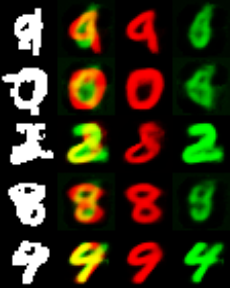
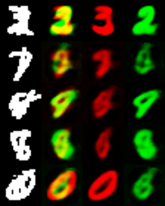
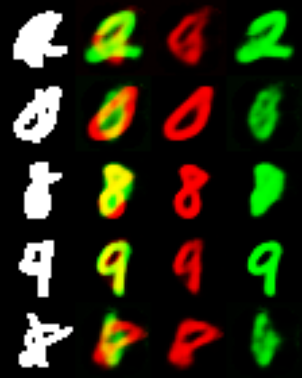
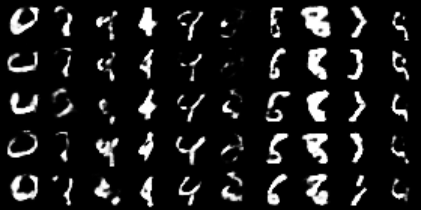

# a simple Tensorflow implementation for CapsNet

# Network configuration

According to  Hinton's paper [Dynamic Routing Between Capsules](https://arxiv.org/abs/1710.09829),But I didn't use the shift(<=2pix) agumentation for images now.

# Train your model

	python model.py

# Results after 10k+ training steps

## classification

The test error rate is roughly 1% .

## segmenting

Here are some images showing the results of segmenting highly overlapping digits:

## image generating conditional on class

I reconstructed some images from random DigitCapsule vectors near the unit sphere,as we can see,it's not so real,but the pervious images show good results.and notice that Figure 4 in the paper is reconstructed from the neighbourhood of real images' embeding,I think this is due to the autoencoder regularization but not the VAE regularization.

