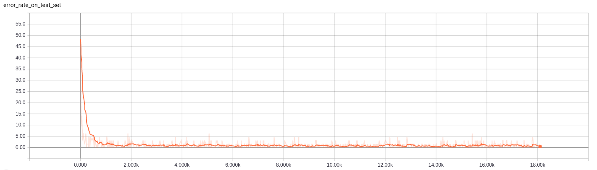
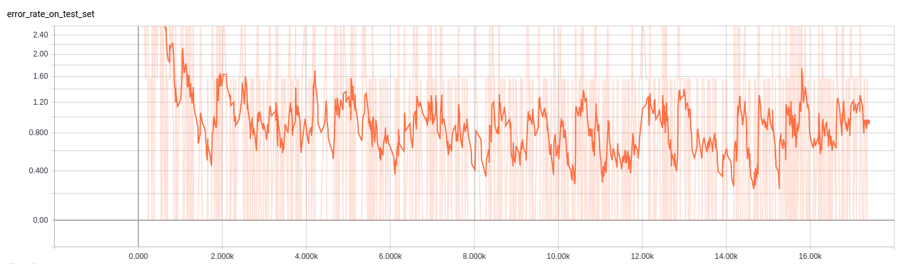
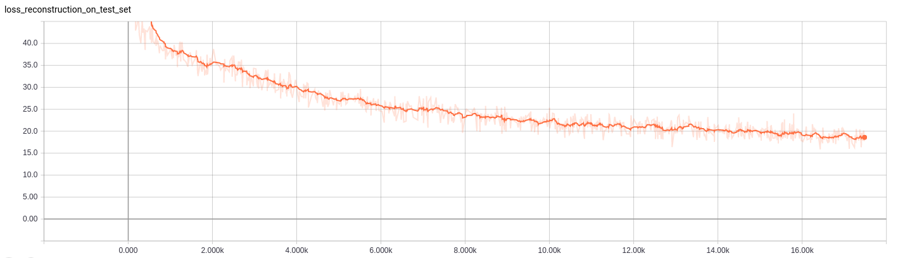
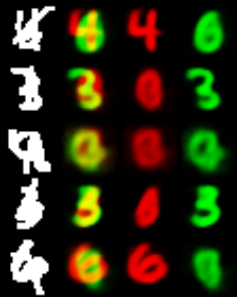
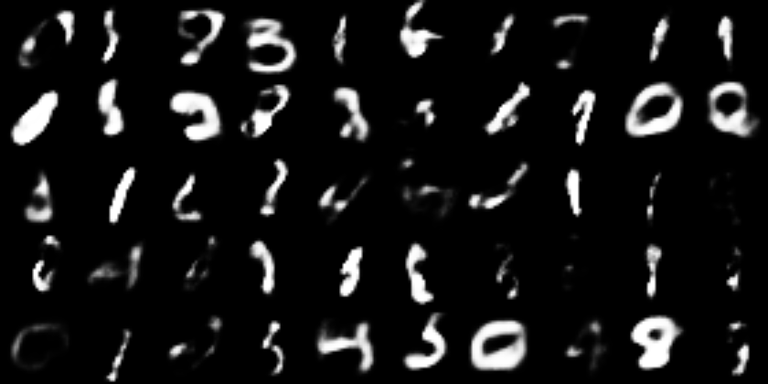
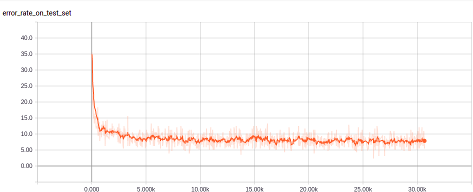
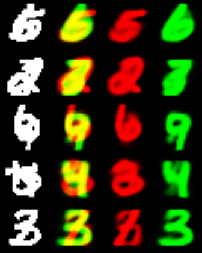
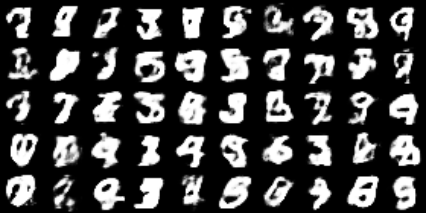

# A simple tensorflow implementation for CapsNet

# Network configuration

According to  Hinton's paper [Dynamic Routing Between Capsules](https://arxiv.org/abs/1710.09829)

# Train your model

	python main.py

you can switch the is_multi_mnist to change the training set between Mnist and MultiMnist

# Results after 10k+ training steps on Mnist

batch_size = 64, lr = 0.001, beta1 = 0.9

## classification

## segmenting

Here are some images showing the results of segmenting highly overlapping digits:

## image generation condition on class

I reconstructed some images from random DigitCapsule vectors near the unit sphere, as we can see, it's not so real, but the pervious images show good results.and notice that Figure 4 in the paper is reconstructed from the neighbourhood of real images' embeding, I think this is due to the autoencoder regularization but not the VAE regularization.

# Results after 30k+ training steps on MultiMnist

batch_size = 128, lr = 0.001, beta1 = 0.9

# Notice
* The accuracy metric on MultiMnist may be different from the paper
* Better results will be got if we run more iterations
* The error rate on test set as showed in figures is only evaluated on one random varing test batch, but not the whole test set.
